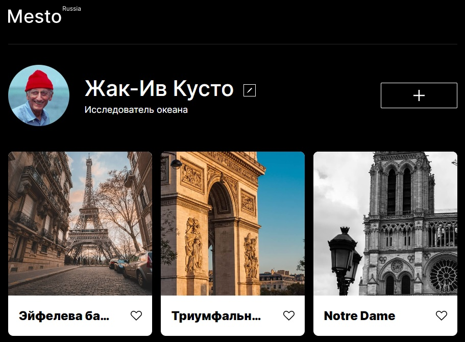

# Мой третий проект: "Место" / My third project: "Mesto"

## Где посмотреть?

Ознакомиться с проектом можно [здесь](https://vveb.github.io/mesto-project/)

## О чем проект
Проект открывает дискуссию о новом подходе к авторскому контенту.

> "Не место красит человека, а человек место"

*Так ли это на самом деле?*

В нашем проекте данная мысль звучит особенно звонко.

Создайте собственное уникальное **Место** и расскажите о нем миллионам.

А пока - приглашаем Вас в родину высокой кухни и моды, город на острове Сите, столицу Франции - Париж, - для знакоства с ее достопримечательностями:

* __Эйфелева башня__ (_fr. Tour Eiffel_) - главный символ Парижа (хоть французы и не взлюбили башню поначалу).
* __Триумфальная арка__ (_fr. L'arc de triomph_) - возведенная по распоряжению Наполеона Бонапарта в ознаменование побед его "Великой армии".
* __Собор Парижской Богоматери__ (_fr. Notre Dame de Paris_) - величественный католический собор, возведенный на острове Сите, откуда когда-то начинался Париж.
* __Сена__ (_fr. La Seine_) - река, на которой стоит Париж.
* __Лувр__ (_Louvre_) - королевский дворец, ныне являющийся одним из крупнейших и популярных художественных музеев мира.
* Сакре-Кёр (_fr. Sacre Coeur_) - католический храм, возвышающий свою "сахарную голову" над самой высокой точкой Парижа - холмом Монмартр.

## Немного о технологиях

* Проект _свёрстан_ с использованием технологий __адаптивной вёрстки__ и __отзывчивого интерфейса__ для наиболее популярных разрешений.

* Использована __технология перестроения сетки__ в зависимости от __ширины__ окна просмотра.

* В скрытом виде свёрстан __popup__, доступный по модификатору `popup_opened`.

###JavaScript

На языке JavaScript реализована функциональность:

* Открытие соответствующих __модальных окон__ по нажатию на кнопки редактирования профиля, добавления карточки, просмотра фото.

* Возможность __поставить лайк__ или __удалить__ карточку.

* Нативная отрисовка карточек фото на основе __template__-заготовки.

* Проверка __корректности__ заполнения форм, верификация ссылки загрузки фото по маске, обязательных полей.

* Форма редактирования профиля __динамически подгружает__ данные со страницы.

* __Не__ используется уязвимая технология добавления разметки с помощью __innerHTML__.